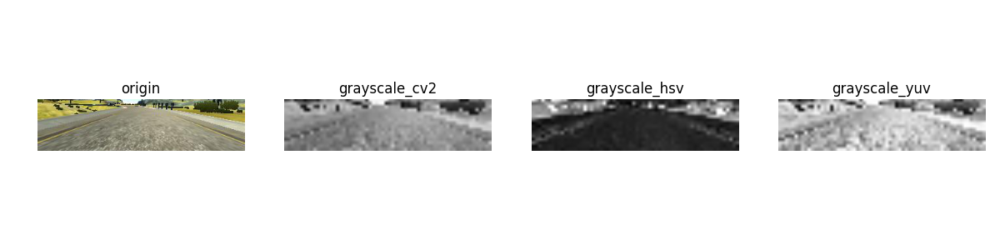

# CarND-Behavioral-Cloning

_**Nan-Tsou Liu**_ 2017-01-24

**<sub>CAUTION: THIS REPOSITORY CONTAINS SEVERAL LARGE SIZE GIF. [CHECK HERE](https://github.com/ddrsmile/CarND-Behavioral-Cloning-Mini) FOR PYTHON, JSON AND h5 FILES</sub>**

## Abstract

### Intrdouction

_**Behavioral Cloning**_ project is one of _**Udacity**_ **Self-Driving Car Engineer Nanodegree**. The task is to build a model with **Convolutional Neural Network** (CNN) to drive the car in a simulator. And the goal is to make the model can drive the car on the track well. The siumulator built by _**Udacity**_ provide two modes, **Training** mode and **Autonomous** mode. The idea is to collect the training data with **Training** mode, where the simulator would record the views as images captured by three cameras, center, left and right direction; and then to train the model with the collected data; and finally to make the model drive the car autonomously. And in order to simplify the task, only steering is the target to be predicted by the model with inputting images.

--

### Approach & Results

As approach of this project, the dataset was firstly balanced by augmenting it with **perturbing steering angles** and **flipping images**. Secondly, the images were preprocessed with **cropping**, **resizing** and **grayscaling**. The number of the data was increased from **8,036** (original number) to **56,364**. I used `validation_split=0.2` in Keras' `model.fit()` method, which means that the dataset is split into 80% as training dataset and 20% as validating dataset. 

The final CNN architecture contains **7** layers (convolutional layer x 2 , max pooling layer x 2, fully connected layer x 2, flatten layer x 1) with total **36,145** trainable parameters. **Exponential linear unit** (ELU) was chosen as the activation function and applied to both 2 convolutional layers and the second dropout layer which is after first fully connected layer. In order to prevent overfitting, dropout with 50% is applied on the second convolutional layer and the first fully connected layer.

I used Adam optimizer with default setting (learning rate is `0.001`) and used **Mean squared error** (mse) to train the model. Batch size was set to `128`. I setup `ModelCheckpoint` and `EarlyStopping` as the callbacks in `model.fit()` so that I did not set epochs. As my observation, most of the training would complete within 30 to 40 epochs. 

In order to make the car can go smoothly more, I control `throttle` with respect to steering, which keep the speed at 25 MPH but slowdown to 22 when steering over 0.1.

And the results are shown below.

| **Track 1** | **Track 2** |
|-----|-----|
|[](https://www.youtube.com/watch?v=JWFDYkYYKF0)|[](https://www.youtube.com/watch?v=DpY0MrDTXYc)|

click for **youtube** videos

## Dataset Summary & Exploration

In this project, I did not get my own data but I used the data provided by Udacity. First of all, I took a look at what the data like. The dataset contains a driving log which has `file path` of the images taken by three cameras, `steering`, `throttle`, `brake` and `speed`. And there are **8,036** records. Each record has three corresponding images, **center**, **left** and **right**. And therefore, there are **24,108** images. And the size of the images is `160 (height) x 320 (width)`.

### Histogram of training data with respect to steering


The purpose of this project is to build and train a CNN model which can drive the car autonomously. So, I plotted a histogram with respect to steering above. As what the histogram shown, most of the data locates at 0 and very slightly shifted to left. This dataset is quite unbalance. And therefore I decided to augment the dataset, especially for adding the data to left and right side.

### Randomly show the images of the training data


As the figure shown above, the images taken by the cameras of `center`, `left` and `right`. The view of the image is not so wide and focus on the road (`center`) and the lanes on both left and right sides (`left` and `right`). Besides, the background like sky, lakes, mountain and so on is also taken by the cameras.

## Augmentation

The main ideas to augment the data are from [**Blog: An augmentation based deep neural network approach to learn human driving behavior**](https://chatbotslife.com/using-augmentation-to-mimic-human-driving-496b569760a9#.43r0ucmcu) by [**Vivek Yadav**](https://chatbotslife.com/@vivek.yadav) and [**Blog: Cloning Driving Behavior by augmenting steering angles**](https://medium.com/@acflippo/cloning-driving-behavior-by-augmenting-steering-angles-5faf7ea8a125#.bkgjexahp) by [**Annie Flippo**](https://medium.com/@acflippo). As the figures show below, the images of `center`, `left` and `right` are used to augment the dataset.


Besides, the purpose of the augmentation is to balance the dataset. And therefore I set a minimum value to `steering` to extract the data so that the data with almost `0 steering` would not be reproduced.

### Perturbing angles
Perturbing angles is to add or substract `steering` very slightly to generate additional data. And perturbing angles slightly would not impact the driving behaviors. I use following equation, `1.0 + np.random.uniform(-1, 1)/30.`, to generate factors and then multiply it with the original steering to generate the additional data. After lots of trial and error, finally I decided to use `0.01` as the minimum value of `steering` to extract the data.

--

### Flipping images
Not all the images data are flipped to generate the additional data. As the results of lots of trial and error, I eventually extract the data with minimum steering, `0.01` like peturbing angles. The method used to flip the images is quite simple with cv2 library. And after flipping images, the image data became symmetric to the bar between 0.01 and -0.01.

--

### Recovery simulation
This awesome idea is from [TODO: blog of recovery simulation and flipping]. It helped me to train my model with the dataset provided by Udacity. The dataset from Udacity only contains those captured with normal driving behavior. So, this idea saved lots of my time to get the recovery dataset by myself. The idea is that the views of the left and the right images focus on the lane or boundary near to the car, and only the images of center camera are used to predict the steering during automous driving. Thus, adding positive steering to the left images and negative steering to the right images to pretent they are the images of the recovery. As lots of people use `0.25` as the adjustment I saw on the slack, I tuned this parameter with `0.25`. After I tried `0.15`, `0.20`, `0.25`, `0.30`, the results are not so different except `0.15` which is not enought for big truning. And the car would become skid severely on the straight road if the adjustment is over 0.30.

--

### Results of each augmenting method


## Preprocess

### Cropping images
As the experience of project **Traffic Sign Classifier**, the target on the image is quite important. I corpped off the upper background with `53px`. I cropped off the haed of the car on lower part with `27px` because I would like to use the images of left and right cameras. The haed of the car on lower part might be the noisy when training the model.

--

### Resizing images
In order to decreas the loading during the training, I resize the images from `160x320` to `32x64`. I cropped the images before resizing the images so the actual size of the final iamges is `16x64`. At the beginning, I resized the images into `16x32` because of the experience of the previous project. However, the results of the autonomous driving was not good. In order to improve the performance, I eventually decided to resize the images into `32x64`.

--

### Grayscaling images



I was struggling on grayscaling because the method, using **YUV** to gracyscale images, does not work at all. The car driven by the model just turned right and ran out of the track at the beginning. Thus, I took a look at the preprocessed images, **grayscale_yuv** shown above. The images look quite bad, and it is really hard to recognize where the road is and where the background is. The results are totally different from those in project **Traffic Sign Classifier**. The probelm, I think, might be that the original size of images is `160x320` and the revolution of the images became so low after resizing them. I did not notice this issue when I checked the results, which is shown in [**Result of each preprocessing methods**](#result-of-each-preprocessing-methods) of grayscaling with original images only. Then I took a look at **RGB2GRAY**, cs2's library because I read some articls which say the grayscale of Y of **YUV** is different from **RGB2GRAY** of cv2. However, the processed image, **grayscale_cv2** shown above, is quite similar to that processed by **YUV**. After I looked for lots of information about COLOR on the internet. [**Self-driving car in a simulator with a tiny neural network**](https://medium.com/@xslittlegrass/self-driving-car-in-a-simulator-with-a-tiny-neural-network-13d33b871234#.olz5xlbqj) attract my attention that the author, [_**Mengxi Wu**_](https://medium.com/@xslittlegrass) uses **saturation (S)** of **HVS** to grayscale the image. The figure he showed looks great to me. So, I decided to use S of HSV to grayscale the images, **grayscale_hsv** shown above.

--

### Results of each preprocessing methods


--

### Histogram of augmented dataset
As the plot shown below, the histogram of the augmented dataset looks better than original one. The two peaks on left and right side are caused by the recovery simulation. At the beginning, I was thinking to generate more data to make the dataset more balanced. I did lots of trail and error that checking the results with different combinations of augmenting data like perturbing the steering twice, extracting the data with minimum steering 0.15 to flipping the images and so on. However, I feel good with the dataset so far. As the result of the augmentation, the number of the recods was incresed to **56,364**.


--

### Randomly pick up the preprocessed images for training model


## CNN Architecture

### Final CNN Architecture

```
    ### SOLUTION: Layer 1: Convolutional with 4x4 patch, 16 features and (4, 4) stride of 'same' border.
    #### INPUT SHAPE is 16x64x1
    model.add(Conv2D(16, 4, 4, subsample=(4, 4), input_shape=(16, 64, 1), border_mode='same'))
    #### Activation function: Exponential linear unit
    model.add(ELU())
    
    ### SOLUTION: Layer 2: Maxpooling with 2x2 patch and (1, 2) stride of 'valid' border.
    model.add(MaxPooling2D((2, 2), strides=(1, 2), border_mode='valid'))

    ### SOLUTION: Layer 3: Convolutional with 2x2 patch, 32 feature and (2, 2) stride of 'same' border.
    model.add(Conv2D(32, 2, 2, subsample=(2, 2), border_mode='same'))
    #### Activation function: Exponential linear unit
    model.add(ELU())
    #### Droupout 50%.
    model.add(Dropout(0.5))
    
    ### SOLUTION: Layer 4: Maxpooling with 2x2 patch and (1, 2) stride of valid border.
    model.add(MaxPooling2D((2,2), strides=(1, 2), border_mode='valid'))

    ### SOLUTION: Layer 5: Flatten.
    model.add(Flatten())

    ### SOLUTION: Layer 6: Fully connected with output 512 feature.
    model.add(Dense(512))
    #### Dropout 50%.
    model.add(Dropout(0.5))
    #### Activation function: Exponential linear unit
    model.add(ELU())

    ### SOLUTION: Layer 7: Fully connected with a single output since this is a regression problem.
    model.add(Dense(1))
```

--

### Output Summary of Final CNN Architecture
```
____________________________________________________________________________________________________
Layer (type)                     Output Shape          Param #     Connected to                     
====================================================================================================
convolution2d_1 (Convolution2D)  (None, 4, 16, 16)     272         convolution2d_input_1[0][0]      
____________________________________________________________________________________________________
elu_1 (ELU)                      (None, 4, 16, 16)     0           convolution2d_1[0][0]            
____________________________________________________________________________________________________
maxpooling2d_1 (MaxPooling2D)    (None, 3, 8, 16)      0           elu_1[0][0]                      
____________________________________________________________________________________________________
convolution2d_2 (Convolution2D)  (None, 2, 4, 32)      2080        maxpooling2d_1[0][0]             
____________________________________________________________________________________________________
elu_2 (ELU)                      (None, 2, 4, 32)      0           convolution2d_2[0][0]            
____________________________________________________________________________________________________
dropout_1 (Dropout)              (None, 2, 4, 32)      0           elu_2[0][0]                      
____________________________________________________________________________________________________
maxpooling2d_2 (MaxPooling2D)    (None, 1, 2, 32)      0           dropout_1[0][0]                  
____________________________________________________________________________________________________
flatten_1 (Flatten)              (None, 64)            0           maxpooling2d_2[0][0]             
____________________________________________________________________________________________________
dense_1 (Dense)                  (None, 512)           33280       flatten_1[0][0]                  
____________________________________________________________________________________________________
dropout_2 (Dropout)              (None, 512)           0           dense_1[0][0]                    
____________________________________________________________________________________________________
elu_3 (ELU)                      (None, 512)           0           dropout_2[0][0]                  
____________________________________________________________________________________________________
dense_2 (Dense)                  (None, 1)             513         elu_3[0][0]                      
====================================================================================================
Total params: 36,145
Trainable params: 36,145
Non-trainable params: 0
____________________________________________________________________________________________________
```

--

### Approach

#### Beginning
At the beginning, I used the model I built in project **Traffic Sign Classifier** which successully recognize the traffic sign well. The model contained 2 convoultional layers, 2 max pooling layer 1 flatten layer and 2 fully connected layers. I rewrote the model with **Keras** and implemented generator which suggested in the instruction. I training the model with the images that I cropped off the background on the upper part of the view by `53px` and the head of the car on the lower part of the view by `27px`. And I did not grayscale the images. So, the size of input data was `80H x 320W x 3D`. 

Besides, I also read the article in the instruction so that I set batch size to 32 and use several epochs like 5 to 10 only. Although it took long time (there were `19,945,921` trainable parameters), the results of training model looked great because the loss kept going down to `0.01xxx`. So that I was confident to have the model to drive the car. However, everything is differet from what I thought. The car run out from the track immediately when I ran the program.

---

#### Struggling
At this moment, I totally have no idea how to rebuild the model and improve the performance. I just kept looking for the information on the internet. I also asked my mentor for the suggestion and he gave me a direction that many people have a lot of luck with [**Nvidia model**](http://images.nvidia.com/content/tegra/automotive/images/2016/solutions/pdf/end-to-end-dl-using-px.pdf). 

In the meanwhile, I noticed that some peer students have built the model by [**comma.ai's steering model**](https://github.com/commaai/research/blob/master/train_steering_model.py) whoes architecture is relatively similar to my original model. With simply comparing these two model, I eventually decided to modified with consulting comma.ai's model. The bigest difference is that I changed activation function from **ReLU** to **ELU**. Thus, I became crazy busy on tuning the parameters of the model and repeated training the model and running automouously driving program to see how the performance is improved. During the time I was trying to rebuild the model, 

I also looked for the information about data preprocessing and data augmenting. The article by [**Vivek Yadav**](https://chatbotslife.com/@vivek.yadav) whom I mentioned at very beginning of the report has given me lots of good idea to augmenting the data especially the awesome idea that to simulate the recovery by using the views of left and right cameras.

---

#### Changing
The key factor that gave me a big progress is that using saturation (S) of HSV to gracyscale the images. This idea is from the article by [_**Mengxi Wu**_](https://medium.com/@xslittlegrass). There are two huge merit of using S of HSV to grayscale images. First, the road and background can be clearly distinguished, especially for the resized images. The difference between different grayscale method is shown [here](#grayscaling-images). Secondly, upon the first merit, the images can be resized into quite small revolution, which connects to 2 further merits. For one thing, it is obvious that the model can be scaled down; for another, the generator is not necessary any more and it resulted in accelerating model training very much. 

Eventually, I preprocessed the images with cropping, grayscaling and resizing, and the size of final images are 16Hx64Wx1D. Because of new preprocessing methods, the model was also being scaled down. I scaled down the model by increasing patch size from 2x2 to 4x4, decreaing the number of feature to half of original number, from 32 to 16 for the first convolutional layer and from 64 to 32 for the second convolutional layer. Besides, the patch size and strides of max pooling layer were also changed, especially for the strides. I used (1, 2) as the stride for both 2 max pooling because the final size of the image would become square. 

Finally, I removed the first fully connected layer, the one has 1024 outputing feature. As the result, the number of trainable parameters was decreased from `19,945,921` to `36,145`. Besides, I setup the ballbacks, **checkpoint** which saves the best weight results during the training and **earlystopping** would terminate the training process if **Mean Squared Error** of validation can not be improved for continuous 4 times. So, I just set batch size to `128` and the maximum epochs to 100.

Final architecture and output summary of the model are shown [here](#cnn-architecture).

Due to removing the generator from the training process, I have to preprocess and augment the dataset beforehand. I noticed that numpy can save the data in binary format very easily, which makes loading data more efficiently. Just for the information, it took about 30 to 40 minutes if I implemented the generator into the training process. However, it took less than 10 minutes from preparing the training data (about 2 minutes to 3 minutes) to completing model training (less than 10s for each epoch).

---

#### Succeeding
After hard work on rebuilding model and tuning the parameters, I eventually made my model drive the car well on both track 1 and track 2. The videos of the results I show at beginning of this report. During the work, I realized that data preprocessing is much important than how to build the an appropriate model. In my humble opinion, the environments of both 2 tracks are quite simple although the background is beautiful and changing alone the road. However, the color and situation of the road are not changing too much so that grayscaling with S of HSV work very well in this project.

Besides, data augmenting also impact the reasults somehow. At the beginning, I did a misktake when I code the program to do augmentation. It resulted in that the car would run out from track at certain part every time. And I was struggling on finding out the reasons and I resolved this kind of issue when I noticed a logic mistake in my program.

Controlling the throttle also help me to make model drive the car smoothly. At the beginning, I did not modified the driving logic and the car would speed up to 30 MHP in the end. And the car became skid severly even it was running on a straight road.

## Challenge: Tiny Model

### Background

[**Blog: Self-driving car in a simulator with a tiny neural network**](https://medium.com/@xslittlegrass/self-driving-car-in-a-simulator-with-a-tiny-neural-network-13d33b871234#.olz5xlbqj) attract my attention that the author, [_**Mengxi Wu**_](https://medium.com/@xslittlegrass) attracted my attention when I was looking for the infromation about **COLOR**. I was shock by that the author trained the model with only 63 trainable parameters and the results of both track 1 and track 2 look quite good. Thus, I would like to challenge that to scale my model down. As the results, I got my tiny model to drive the car well on both track 1 and track 2.

--

### CNN Architecture of Tiny Model

#### Final CNN Architecture

```
### SOLUTION: Layer 1: Convolutional with 3x3 patch, 2 feature and (2, 2) stride of 'valid' border
#### ReLU is chosen as the activation function
model.add(Conv2D(2, 3, 3, subsample=(2, 2), input_shape=(16, 32, 1), border_mode='valid', activation='relu'))

### SOLUTION: Layer 2: Max pooling with 2x4 patch and (4, 4) stride of 'same'
model.add(MaxPooling2D((2, 4), strides=(4, 4), border_mode='same'))
#### Droupout 25%
model.add(Dropout(0.25))

### SOLUTION: Layer 3: Flatten
model.add(Flatten())

### SOLUTION: Layer 4: Fully connected with a single output since this is a regression problem
model.add(Dense(1))

```

#### Output Summary of Final CNN Architecture

```
____________________________________________________________________________________________________
Layer (type)                     Output Shape          Param #     Connected to                     
====================================================================================================
convolution2d_1 (Convolution2D)  (None, 7, 15, 2)      20          convolution2d_input_1[0][0]      
____________________________________________________________________________________________________
maxpooling2d_1 (MaxPooling2D)    (None, 2, 4, 2)       0           convolution2d_1[0][0]            
____________________________________________________________________________________________________
dropout_1 (Dropout)              (None, 2, 4, 2)       0           maxpooling2d_1[0][0]             
____________________________________________________________________________________________________
flatten_1 (Flatten)              (None, 16)            0           dropout_1[0][0]                  
____________________________________________________________________________________________________
dense_1 (Dense)                  (None, 1)             17          flatten_1[0][0]                  
====================================================================================================
Total params: 37
Trainable params: 37
Non-trainable params: 0
____________________________________________________________________________________________________
```

### Approach

1. Removed the second convolutional layer.
2. Decreased the number of feature of each layer.
3. Changed the methods to preprocess data.
4. Resolved the probelms, shown below, caused by scaling down.

At the beginning, I rebuilt the model by removing the second layer, the second max pooling layer and first fully connected layer. And then I changed the activation function from **ELU** to **ReLU**. At the same time, I decreased the number of the feature to very small value, from 16 to 2. I kept the droupout to prevent overfitting but decreased dropout ratio to `25%` because the model is quite small.

Eventually, I did the same data augmenting. Instead of cropping the image, I resized the images smaller, which is `16Hx32W`. And I used the same grayscaling method. The training method is the same too, which is adam optimizer with default setting.

However, I encountered 3 big problems (shown below) when I was trying to build the tiny model. The first problem is that the car skidded severly on the stone bridge, which I resolved by controlling the speed down to 20 MHP.

Neck 1 and 2 took me lots of time to resolve. At the beginning, I decreased batch size to 32 and the combinations of data augmenting was also different. I did lots of trial and error of data augmenting, but the results were not imporved. I was thinking is it caused by overfitting or the not balanced training data. Neck 1 is resolved by increasing batch size to 56; doubling the number of additional data by perturbing steering angle; and adding recovery data **after** flipping the images.

However, Neck 2 can not be resolved by slightly tuning the parameters of data augmenting. I did not touch data preprocssing and the parameters of the model because my model was quite similar to [_**Mengxi Wu's**_](https://medium.com/@xslittlegrass) model. The difference between the models is that  the stride was set to (1, 2) for max pooling layer. The reason I did not change preprocssing method is that I thought the most important factor is that using S of HSV to grayscale the images. Additionally, [_**Mengxi Wu's**_](https://medium.com/@xslittlegrass) blog has proven that `16Hx32W` resized images work. When doing trial and error, I have to be careful not to make the problem of Neck 2 happen again. Thus, resolving the problem of Neck 2 took much more time. Fortunately, I finally got my model drive car well by changing the combination of data augmenting, tuning batch size to 128 and having it get trained enough. This is the reason I removed callbacks from **Keras**'s `model.fit()` method.

| **Skid** | **Neck 1** | **Neck 2**|
|-----|-----|-----|
||||

--

### Results
| **Track 1 tiny** | **Track 2 tiny** |
|-----|-----|
|[](https://www.youtube.com/watch?v=6Fn69q5LCi4)|[](https://www.youtube.com/watch?v=7EyvJpVEaAQ)|

click for **youtube** videos

## Reflection

In my humble opinion, there is a big gap between previous project and this one. It took much more time from me to complete this project and I got to look for lots of information and check they are useful or not. But this is a really interesting project. Thank to this project, I have learn much more about deep learning and convolutional nerual network. Besides, this project made me realize that the improtance of deep learning is about not only how to build nerual network model appropriate but also how to prerpocess and data augment the dataset.
About the challenge that build a tiny model to drive the car autonomously, it was more difficult than what I thought. It took me more than 3 week to achieve it. But, I think I have done well on this project and I feel happy that I can achieve the goal and an extra challenge set by myself.

## Reference

* [**Udacity**](https://www.udacity.com)
* [**Keras Document**](https://keras.io/)
* [**Self-driving car in a simulator with a tiny neural network**](https://medium.com/@xslittlegrass/self-driving-car-in-a-simulator-with-a-tiny-neural-network-13d33b871234#.olz5xlbqj) by [_**Mengxi Wu**_](https://medium.com/@xslittlegrass)
* [**An augmentation based deep neural network approach to learn human driving behavior**](https://chatbotslife.com/using-augmentation-to-mimic-human-driving-496b569760a9#.43r0ucmcu) by [**Vivek Yadav**](https://chatbotslife.com/@vivek.yadav) 
* [**Cloning Driving Behavior by augmenting steering angles**](https://medium.com/@acflippo/cloning-driving-behavior-by-augmenting-steering-angles-5faf7ea8a125#.bkgjexahp) by [**Annie Flippo**](https://medium.com/@acflippo)
* [**comma.ai**](https://github.com/commaai/research/blob/master/train_steering_model.py)
* [**Nvidia model**](http://images.nvidia.com/content/tegra/automotive/images/2016/solutions/pdf/end-to-end-dl-using-px.pdf)
* [**A Simple File Format for NumPy Arrays**](https://docs.scipy.org/doc/numpy/neps/npy-format.html)
