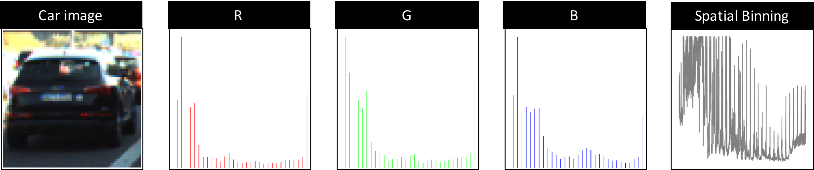
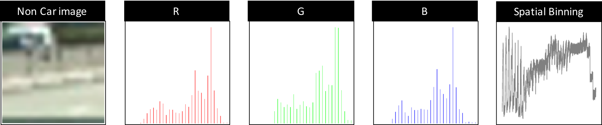

# CarND-Vehicle-Detection

_**Nan-Tsou Liu**_ 2017-03-01

## Abstract

### Intrdouction

_**Vehicle Detecting and Tracking**_ is one of _**Udacity**_ **Self-Driving Car Engineer Nanodegree**. There are two main tasks in this project. One is to extract the features of vehicles and non-vehicles to train a model with machine learning technique. The other one is to use the model to detect the vehiles on the video and then draw bounding boxes on the detected vehicles. The project video provided by _**Udacity**_ records The scenes taken by a camera set to the front of a car. And 6 images for testing and 2-second testing video are also provided.

The resource used to train the model come from a combination of the [GTI vehicle image database](http://www.gti.ssr.upm.es/data/Vehicle_database.html), the [KITTI vision benchmark suite](http://www.cvlibs.net/datasets/kitti/), and examples extracted from the project video itself.
 _**Udacity**_ has collected and prepared the data that we can use in our project.

--

### Approach

#### Training Model

Briefly, there are two main steps of training model, feature extracting and model training. The image of the tasks are shown below.


As the approach for training model, I extracted `histogram of color feature` with **RGB** color space, `spatial binning features` with **RGB** color space and `histogram of oriented gradient features` with **YUV** color space from the images of vehicles and non-vehicles. And then I concatenated all of these features. In order to prevent that some features are eliminated by the huge difference in quantity, I normalized the feature with **sklearn's** `StandardScaler` method. Before feeding the features to train the model, I splited the data into 80% training data and 20% testing data with **sklearn's** `train_test_split` Finally, I chose `Linear Support Vector Classification` (LSVC) which is suggested in the lesson. The training results are `1.0` for **Train Accuracy** and 0.9918 for **Test Accuracy**.

#### Detecting Vehicles

First, I built 4 window sets with 4 different size, `80 x 80`, `100 x 100`, `120 x 120`, `150 x 150` with 4 different region in y (height) direction, `[(height/2, height*0.7), (height/2 + 20, height*0.75), (height/2 + 50, height*0.8), (height/2 + 80, height*0.92)]` where the height in this project is `720`. Then the images of each window are taken into my model to detect whether there is a vehicle or not. 

As the primary results, there might be multiple windows on a certain car or some windows locate at non-vehicles regions (**False Positive**). I applied heatmap on primary results to merge the multiple boxes on a certain car and eliminate the boxes which are **False Positive**. Finally, I draw the boxes on where the results of heatmap are.

Besides, I also added the 2 methodologies. The first one is to memorize the heatmap results for every 3 frame and then take the average heatmap with weight. So that the boxes can track the vehicles smoothly along with the video. Second, I implement another series of sliding windows which only focuses on the regions around the vehicles detected in previous frame. So that I can save much time during processing the video. But I also performed full scan every 5 frame to catch the new coming in vehicles.Besides, I also added logic that skip the detection for 3 frames if there is no vehicle detected in previous frame.

As the final result, I drew not only the boxes on the detected vehicle, but also the overlay of lane lines used by the module I built in project _**Advanced Lane Finding**_.


### Result

[](https://youtu.be/YQA2hBb80S4)

click the image for **youtube** videos

--

## Feature Extraction

I basically completed these tasks by following the instruction in the lessons.

### Histogram of Color Feature & Spatial Binning Feature

**<sub>featureextractor.py: get_color_hist, get_spatial_binning</sub>**</sub>**

**Numpy's** `histogram` is used to extract `histogram of color feature`. The implement of this method is quite simple.

`Spatial binning feature` can be easily extracted by using **Numpy's** `ravel` method. Before extracting `spatail binning feature`, I resized the image to `32 x 32` which I got the satisfying result after I did simple trial and error on the testing images.

The following example shows the difference between car and non-car images. As what we can observe, both the histogram distribution and spatail binning distribution of car image is quite different from that of non-car image. After several test on the testing images, I finally decided to use `RGB` color space to extract `histogram of color feature` and `spatial binning feature` in the this project.





--

### Histogram of Orient Gradient (HOG)

**<sub>featureextractor.py: get_hog</sub>**

I extract `histogram of orient gradient` (`HOG`) by using **scikit-image's** `hog` method. At the beginning, I used the values introduced in the lesson for the parameters, oriention is `9`, pixels per cell is `8` and cells per block is `2`. After the simple experiment that changing the value slightly, I did not see much difference among each parameter set.

Besides, I firstly extract `HOG feature` with `RGB` color space. However, the results did not satisfy me. After trying different color space, `HSV`, `HSL`, `YUV` and `YCrCb`. I finally chose `YUV` color space as the final decision to move to next step.

As the conclusion, I finally used the values introduced in the lessons for the parameters and inputted the images with `YUV` color space.

The following example shows the visualized  `HOG` image of both car and non-car. And `HOG` of `Y` channel show the difference between car and non-car image most.


--

## Model Training

**<sub>train_lsvc.py, featureextractor.py: extract_features</sub>**

The procedure of the training model is shown in the figure below. 


First, I load all the images of vehicles and non-vehicles. And then I applied **feature extraction** on it, which the output is the concatenated featre array of all the images. As the suggestion from the instruction in the lesson, I used **sklearn's** `StandardScaler` method to normalize the features. The scaled features were splitted into training data with 80% and testing data 20% by **sklearn's** `train_test_split` before feeding the scaled features into the model. 

As the final settings for training model, `oriention: 9, pixels per cell: 8,  cells per block: 2` is used to extract `HOG` features, `image size: 32 x 32, bin: 32` is used to extract `spatial binning feature` and `bin: 32` is used to extract `histogram of color feature`.
Besides, `YUV` color space is used in `HOG feature` extraction and `RGB` color space is used in `histogram of color feature` and `spatial binning feature`.

About the parameters for `LSVC` model, I used the default values for the parameters as the initial trial. Fortunately, the result of the training model is quit good after I tested model with the testing images and test video. And therefore, I did not tune the model with varying the parameters much.
The default values of each parameter can be found in [sklearn.svm.LinearSVC](http://scikit-learn.org/stable/modules/generated/sklearn.svm.LinearSVC.html)

The following information is the training result:

```
Train Accuracy of SVC =  1.0
Test Accuracy of SVC =  0.991835585586
```

--

## Detecting Vehicles

As the main task of this project, I spent lots of time on the trial and error here, especially for sliding windows and smoothing vehicles tracking.

### Sliding Window

**<sub>utils.py: slide_window; vehicledetector.py: get_win_set, get_small_region, get_small_region_win_set</sub>**

The functions of sliding windows is used the one taugh in the lessons. I did lots of trial and error to design how to enclose the region for detecting vehicles.

First of all, I decided to focus on the lower half, not including the hood of the car, of the images only. Rather than fixing the region to detect the vehicles, I first slided the window with small size, `80 x 80` and small region (in y direction only), `360 to 504` and it is just beneath the middle part of the images. And then I moved down the regions for sliding windows with increasing window size, `100 x 100, 120 x 120 and 150 x 150`, and the areas of the region, `380 to 540 (160), 410 to 576 (166) and 440 to 662 (222)`. So that the efficiency of scanning the region is better in my opinion. Besides, I also tried several ratio of overlapping windows, `0.7, 0.75, 0.8 and 0.9`. With the consideration of both efficiency and detecting results, I finally decided to use `0.8` as the ratio of overlapping windows. The following example shows the sliding windows in each region.


In order to improve the performance of processing the video, I added a methodology that scanning the small regions around the detected vehicles in the previous image. Fisrt, I stored final boxes created in the previous image and the number of detected vehicles (by length of `heatmap's lables`). The in the detection of the current image, the `VehicleDetector` would get the small region around the detected vehicles (see following code, `get_small_region`). 

#### get small region (around the detected vehicles)
```python
def get_small_region(self, bbox_list):
    x_start = 1280
    x_stop = 0
    y_start = 720
    y_stop = 0

    if len(bbox_list) > 0:
        for bbox in bbox_list:
            x1 = bbox[0][0]
            y1 = bbox[0][1]
            x2 = bbox[1][0]
            y2 = bbox[1][1]

            x_start = np.minimum(x_start, np.minimum(x1, x2))
            x_stop = np.maximum(x_stop, np.maximum(x1, x2))
            y_start = np.minimum(y_start, np.minimum(y1, y2))
            y_stop = np.maximum(y_stop, np.maximum(y1, y2))

        return x_start, x_stop, y_start, y_stop
```

Besides, in order to prevent the windows which is out of the images or higher than the middle line (in y direction) of the images, I added the constraint to the method used for creating the window set of small region. And I also added the margins in both x and y directions to ensure the small region can catch the vehicles (see code below, `get_small_region_win_set`)

```python
def get_small_region_win_set(self, image, x_start, x_stop, y_start, y_stop):
    # define the margins of x and y for detecting the area around the detected vehicles
    x_margin = 25
    y_margin = 10

    # prevent x_start which outside the image
    x_start = np.maximum(x_start - x_margin, 0)
    x_stop = np.maximum(x_stop + x_margin, image.shape[1])
    # prevent y_start which is higher than half height of the image
    y_start = np.maximum(y_start - y_margin, image.shape[0]//2)
    # prevent y_stop which is lower than the hood of car
    y_stop = np.minimum(y_stop + y_margin, np.int(image.shape[0] * 0.92))

    tracking_win_set = []
    for size in [64, 80, 100, 120, 150]:
        tracking_win_set += utils.slide_window(image,
                                            x_start_stop=[x_start, x_stop],
                                            y_start_stop=[y_start, y_stop],
                                            xy_window=(size, size),
                                            xy_overlap=(0.8, 0.8))
    return tracking_win_set
```

The window sizes of sliding window in small regions are `64 x 64, 80 x 80, 100 x 100, 120 x 120 and 150 x 150`. I did not move the small region along with the window size because I have to ensure the small regions focus on the detected vehicles to track them. And the ratio of overlapping window is as the same as the default one, `0.8`. The following example show the sliding windows in small regions with different window sizes.


--

### Detection

**<sub>vehicledetector.py: detect, predict</sub>**

This step is quite simple that just feed the features to the model and then postprocess the output for the fianl results. Before feeding the features into the model, **sklearn's** `StandardScaler` method is used to normalize the features. As the primary detecting result, shown below, there are multiple boxes on a certain detected vehicles. I colored each box with correspondingg probability. Besides, there are some boxes which are **False Positive** can be observed. 


--

### HeatMap

**<sub>heatmap.py</sub>**

As what I mentioned in previous paragraph, **Detection**, there are some boxes which are **Fasle Positive** and the detected vehicles have multiple boxes on them. `HeatMap` is used to merge the boxes on a certain vehicle and eliminate the boxes which is **False Positive**. The methods of heatmap are introduced in the lessons. In order to appy heatmap on processing video, I create a class, `HeatMap`, which memorize the heatmap results for 3 frams and calculate the weighted average result with previous 3 heatmap and current heatmap. I set weitght of **previous** weighted average heatmap to `2/3` and set the one of current heatmap to `1/3`. By this implementation, I smooth the change of the boxes on the scenes along with the video.

About the `threshold` applied to primary heatmap result, I have tried `0`, `1`, `2`, `3` and `10` as the `threshod`. As the primary detecting results from my model, `threshold 10` would filter out all the heatmap. `threshod 0 and 1` did well on building the boxes on the detected vehiles. However, some of **False Positive** boxes remainded. Therefore, I eventually chose `2` as the `threshold` although the boxes on **white** car is not so well.

The following example shows the primary detecting results, adding heatmap and filtered heatmap.


--

### Draw overaly of lane lines

**<sub>LaneFinder.lanefinder.py</sub>**

`LaneFinder` is the module I built in the previous project, _**Advanced Lane Finding**_. In order to combine the results of `LaneFinder` and `VehicleDetector`, I slightly rewrite `process` method in both `LaneFinder` and `VehicleDetector`, which I could collect the required image and information for final output in method `combined_processor`, which is in [`process_video.py`](process_video.py)


--

### Video Processor & Conclusion

**<sub>process_video.py</sub>**

There two main methodologies used for processing video. The one is **sliding window in small region**. The other is **calculating weighted average heatmap**, which I have introduced in the previous paragraphes. The former is used to improve the efficiency of processing video; and the latter is used to smooth the change of boxes along with video. Besides, I also added the logic to skip the detection for three frames if there is no detect vehicles in the previous frame so that I can promote the efficiency of processing video.

In order to combine `LaneFinder` and `VehicleDetector`, I rewrite `process` method of both classes. Orginally `process` return the processed image so that `VideoFileClip` can use it to create the new video. Therefore, I rewrite the one of `LaneFinder` to collect the overlay, curvature and offset information; and rewrite the other of `VehicleDetector` to collect `bbox_list` which contains box position information of final detecting results. As the final method, `combined_processor`, I combined these information into the final output images. And the following video is the final result of this project, which I show it at the very beginning of this project.

[](https://youtu.be/YQA2hBb80S4)

click the image for **youtube** video
--

## Discussion

I was very lucky that I did not spend too much time on model training and the model did well on detecting vehicles. However, training model should take lots of time from me beause there are many parameters need to be tuned. And therefore I quite double that my model can be apply on any other case because I noticed that my model is weak at detecting **white** car. I tried to improve the performance of detecting **white** car by tuning the parameters in `VehicleDetector` and some methods in `utils`. However, it also raised the problem on **False Positive**. Thus, I think it might be the limitation of my model. 

The biggest difficulty is to build `process` function which used to create the final output images. At the beginning, it took so much time on processing video. I thought the bottleneck might be scanning the windows so that I implemented **sliding windows in small region** and decreased the times that scanning the windows by adding logic to skip the detection. As the result, the processing time was 80% decreased.

Increasing the robustness of the model is the highest priority in my opinion. To achieve this goal, using **sklearn's** `GridSearchCV` may be a good option, which looks for the best parameters with the consideration of the color space for all the features, the parameters of **scikit-image's** `hog` method, `histogram of color feature`, `spatial binning feature` and the classifier. Besides, I only tried `LSVC` classifier this time. I think it is worthy to try different classifiers. With the robust model, the detection can be more precise because we can increase the `threshold` used for filtering the heatmap. And the extracted the bounding boxes can precisely locates at the vehicles. I did not calculate centroid and the momentum of the detected vehicles this time. I tracked the detected vehicles and smoothed the change of the bounding box by averaging the results of heatmap. In order to improve the performance, using momentum to track the vehicles might be a good option.

Last, as my experience that processing video took almost 1 hour for a 50-second video, using computer vision with basic machine learning technique to detect the vehicles is too slow to practice real-time detection. I saw the some discussion in **slack** about deep learning and nerual network like **YOLO** or **SSD** (**Single Shot Detection**), which are more efficient to perform the detection. I am quite interested in that and would like to get them a try.

## Reflection

Basically, I completed most of the task by following the instruction in the lessons. The lessons gave us lots of useful functions that I implemented in my model. And compare this project with the previous one, I spent few time on it but I still had been working more than 20 hours per week. Due to the deadline of this project, which I could not catch, I could not deep into each concept, knowledge and technique very much. There are still lots of thing that I am confused like I do not understand we need momentum to track the detected vehicles. On the other hand, I did learn lots of technique to detect a certain object that I had no idea how to practice. And I felt lots of fullfillment after I succeesfully combined `LaneFinder` and `Vehicledetector` to preset the result.
