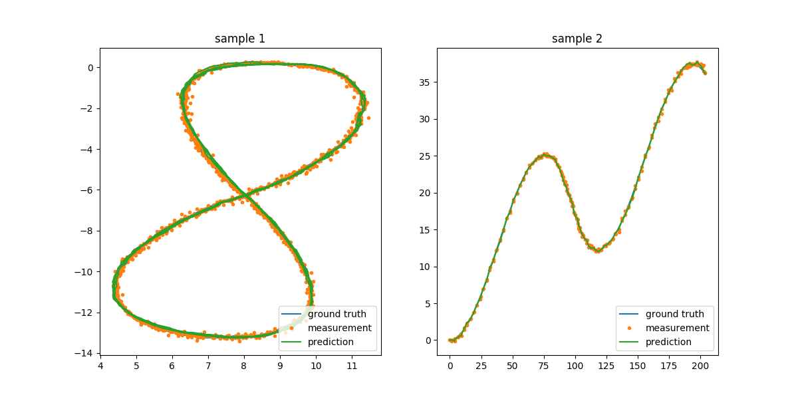

# CarND-Unscented-Kalman-Filter-Project

_**Nan-Tsou Liu**_ 2017-04-10

## Abstract

_**Unscented Kalman Filter Project**_ is one of _**Udacity**_ **Self-Driving Car Engineer Nanodegree**. The task is to complete the source codes of unscented Kalman filter and run it with the sample provided by _**Udacity**_. This porject was carried out with the start code provided by _**Udacity**_ which you can check [**HERE**](https://github.com/udacity/CarND-Unscented-Kalman-Filter-Project). As the final rmse results, I got `0.0490668, 0.0572616, 0.516999, 0.535125` for `sample-laser-radar-measurement-data-1.txt` and `0.172379, 0.182651, 0.2168, 0.286419` for `sample-laser-radar-measurement-data-2.txt`.

### Visualization

## Dependencies

* cmake >= 3.5
 * All OSes: [click here for installation instructions](https://cmake.org/install/)
* make >= 4.1
  * Linux: make is installed by default on most Linux distros
  * Mac: [install Xcode command line tools to get make](https://developer.apple.com/xcode/features/)
  * Windows: [Click here for installation instructions](http://gnuwin32.sourceforge.net/packages/make.htm)
* gcc/g++ >= 5.4
  * Linux: gcc / g++ is installed by default on most Linux distros
  * Mac: same deal as make - [install Xcode command line tools]((https://developer.apple.com/xcode/features/)
  * Windows: recommend using [MinGW](http://www.mingw.org/)

## Basic Build Instructions

1. Clone this repo.
2. Make a build directory: `mkdir build && cd build`
3. Compile: `cmake .. && make`
   * On windows, you may need to run: `cmake .. -G "Unix Makefiles" && make`
4. Run it: `./UnscentedKF path/to/input.txt path/to/output.txt`. You can find
   some sample inputs in 'data/'.
    - eg. `./UnscentedKF ../data/sample-laser-radar-measurement-data-1.txt output.txt`

## Call for IDE Profile

Please check [ide profile instruction](ide_profiles/README.md)

### Editor Settings

The following settings are suggested to make the source codes in consistent.

* indent using spaces
* set tab width to 2 spaces (keeps the matrices in source code aligned)
